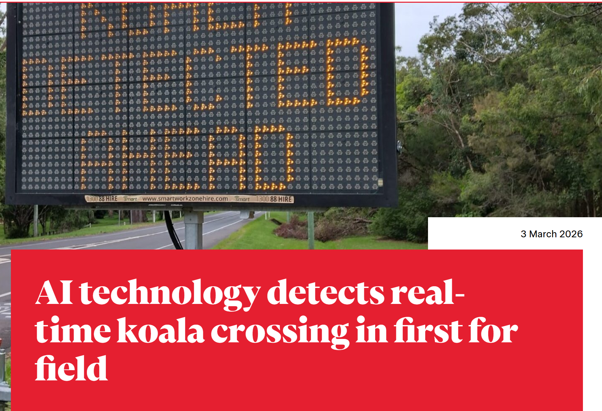

# e-portfolio-1-Artificial-Intelligence

A collection of artefacts that demonstrate what I have learnt about Artificial Intelligence this week

## Artefact 1: What is Artificial Intelligence (AI)?

https://www.youtube.com/watch?v=dx_Ruw8vufI

### Summary of the artefact

The video by Future with Fawzi (2025) discusses AI, including its classification, especially AI black boxes that give different outputs. I liked that the video also explains how AI is created and trained through machine learning, AI bias, AI image creation, AI energy costs, and the history of AI, where I learned what AI winters are.

### Justification on why I chose the artefact

I included this video as it covers complicated AI in an easy-to-understand manner. I was amused by the penguin-based analogy the author uses at 4:00, in which he explains common types of AI bias as a child who grew up in Antarctica would see them. It made me consider how training data, ownership, and algorithms influence AI bias, as I had only understood bias through low-quality training data.

## Artefact 2: AI Technology Detects a Koala Crossing in Real Time

*Source: Rosengreen (2026).*

https://news.griffith.edu.au/2026/03/03/ai-technology-detects-real-time-koala-crossing-in-first-for-field/

### Summary of the artefact

In this article, Rosengreen (2026) describes how a prototype AI-powered camera embedded in a smart road sign successfully detected and recorded a koala crossing the road in real time. The camera employs edge computing (a decentralised IT architecture that processes data near its source) and real-time video analysis, which may, in the future, save countless Australian wild animals' lives, in my opinion (Rosengreen 2026)!

### Justification on why I chose the artefact

I chose this article because it expands on the workshop's discussion of AI-enabled cameras like Waymo's through a different lens. Moreover, this technology somewhat mitigates AI’s negative ecological impact by helping protect Australian wildlife. I believe this technology can be adapted for other animals in the future, and one day we will no longer see the typical Australian roadway landscape filled with downed kangaroos and possums, thanks to AI.

## Artefact 3: Scholarly Article

*Source: Assael et al. (2025, p. 141).*

https://www.nature.com/articles/s41586-025-09292-5

### Summary of the artefact

The article by Assael et al. (2025, pp. 141-143) introduces Aeneas, a generative neural network for contextualising ancient Latin inscriptions. The most mind-blowing part of the article to me is that the model can process both images of inscriptions and text transcriptions, addressing a limitation of earlier text-centred AI approaches to epigraphy. I found it interesting that Aeneas also uses historically enriched representations to retrieve relevant inscription parallels, which is a new analysis dimension of language models to me.

### Justification on why I chose the artefact

I picked this article because I have dreamed of becoming an IT archaeologist since childhood, and AI makes it possible! Using artificial intelligence like this opens up endless possibilities for adapting the technology to other ancient languages, beyond Latin epigraphy, to resolve unsolved mysteries of the past.

## Artefact 4: Workshop Personal Reflection

**Workshop Week 2, 21/07/2026. Tutor: Gitte Galea. Online Campus**

## Proof of attendance

### Summary of the artefact: My Personal Reflection

This week, I learned about AI as a "black box", where internal AI processes remain uncertain. Galea (2026) explains that such a box cannot be opened, traced, or reconstructed to show its exact generation path. I was then struck by a discussion on police body camera videos being vulnerable to manipulation, especially when no one can prove that stolen material was used.

### Justification on why I chose the artefact

The screenshot shows my chat message about leaked police body-camera videos on YouTube that may be used unethically to generate AI content. I included this moment because it highlights a complex legal area without clear guidelines. This workshop made me think about AI's capabilities and whether there's an ethical way to use it without a legal framework infringing on free speech.

## References in CQU Harvard Style
Assael, Y, Sommerschield, T, Cooley, A, Shillingford, B, Pavlopoulos, J, Suresh, P, Herms, B, Grayston, J, Maynard, B, Dietrich, N, Wulgaert, R, Prag, J, Mullen, A & Mohamed, S 2025, ‘Contextualizing ancient texts with generative neural networks’, *Nature*, vol. 645. DOI: 10.1038/s41586-025-09292-5

Future with Fawzi 2025, *AI simply explained in 12 minutes*, video, 31 January, viewed 23 July 2026, https://www.youtube.com/watch?v=dx_Ruw8vufI

Galea, G 2026, Week 2 Lecture: Artificial Intelligence, COIT11223: ICT Ethics and Governance in Society, CQUniversity, viewed 21 July 2026, http://moodle.cqu.edu.au

Rosengreen, C 2026, ‘AI technology detects real-time koala crossing in first for field’, *Griffith News*, 3 March, viewed 24 July 2026, https://news.griffith.edu.au/2026/03/03/ai-technology-detects-real-time-koala-crossing-in-first-for-field/
