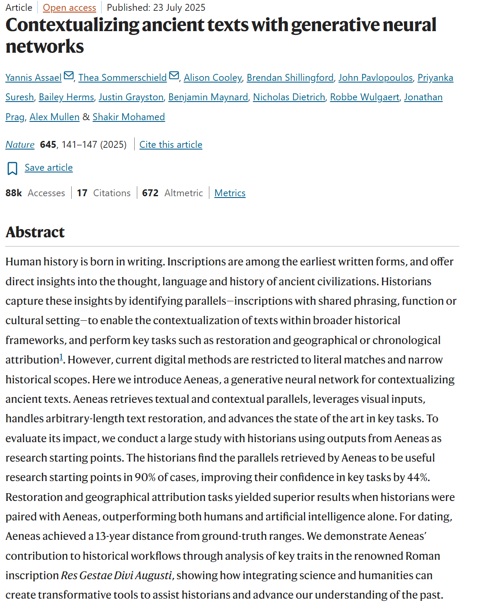
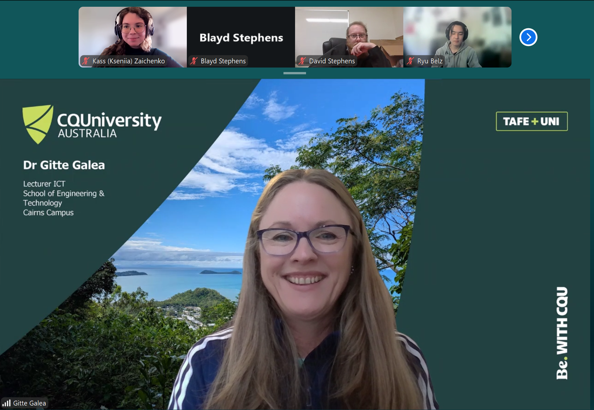

# e-portfolio-1-Artificial-Intelligence

A collection of artefacts that demonstrate what I have learnt about Artificial Intelligence this week

## Artefact 1: What is Artifical Intelligence (AI)?

https://www.youtube.com/watch?v=dx_Ruw8vufI

### Summary of the artefact

[Write summary here]

### Justification on why I chose the artefact

[Write justification and reflection here]

## Artefact 2: A News article I found this week

https://www.abc.net.au/news/2026-04-15/sa-teen-pleads-guilty-over-deepfake-images/106567132

### Summary of the artefact

[Write summary here]

### Justification on why I chose the artefact

[Write justification and reflection here]

## Artefact 3: Scholarly Article

*Source: Assael et al. (2025, p. 141).*

https://www.nature.com/articles/s41586-025-09292-5

### Summary of the artefact

[Write summary here]

### Justification on why I chose the artefact

[Write justification and reflection here]

## Artefact 4: Workshop Personal Reflection

**Workshop Week 2, Wednesday, 21/07/2026. Tutor: Gitte Galea. Online Campus**

## ✦ ˚₊‧ Screenshot of me attending the Workshop ‧₊˚ ✦ 

### Summary of the artefact: My Personal Reflection

[Explain what happened during the workshop and what you learnt]

### Justification on why I chose the artefact

[Explain why you selected this workshop moment and how it developed your understanding of Artificial Intelligence]

## References in CQU Harvard Style
Assael, Y, Sommerschield, T, Cooley, A, Shillingford, B, Pavlopoulos, J, Suresh, P, Herms, B, Grayston, J, Maynard, B, Dietrich, N, Wulgaert, R, Prag, J, Mullen, A & Mohamed, S 2025, ‘Contextualizing ancient texts with generative neural networks’, *Nature*, vol. 645. DOI: 10.1038/s41586-025-09292-5

Blandis, E 2026, ‘Landmark plea as teen admits creating or altering sexually explicit deepfakes’, *ABC News*, 15 April, viewed 23 July 2026, https://www.abc.net.au/news/2026-04-15/sa-teen-pleads-guilty-over-deepfake-images/106567132

Future with Fawzi 2025, *AI simply explained in 12 minutes*, video, 31 January, viewed 23 July 2026, https://www.youtube.com/watch?v=dx_Ruw8vufI
